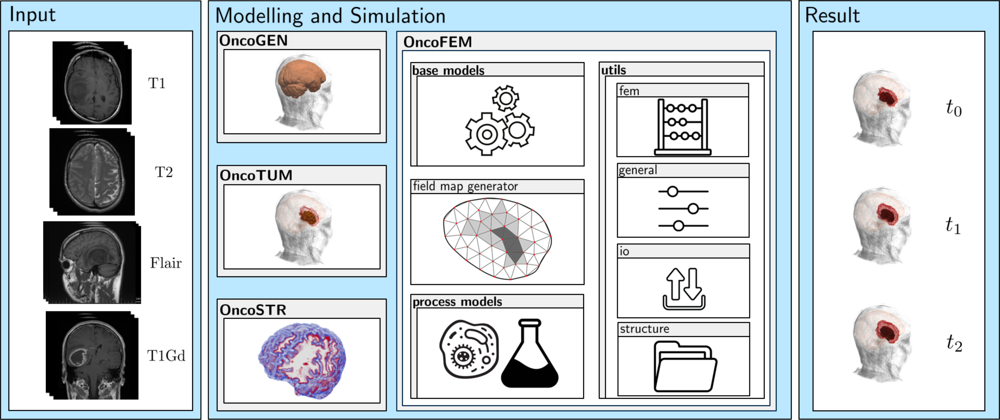

# OncoGEN
[](https://www.repostatus.org/#active) 

OncoGEN is a **gen**eralisation tool designed to standardise medical images of **onco**logical diseases, enabling 
advanced image processing techniques. In general, the workflow consist of:
1. Transformation of DICOM image series to NIFTI with dicom2niix [1].
2. Bias correction of the image intensities with the N4 algorithm [2].
3. Co-registration into an atlas with CaPTk [3].
4. Skull stripping with BrainMaGe [4].

* [Software availability](#software)
* [Installation and machine requirements](#installation)
* [Tutorial](#tutorial)
* [How to develop](#howto)
* [How to cite](#howtocite)
* [Literature](#literature)

## <a id="integration"></a> Integration of OncoGEN

OncoGEN is part of a module based umbrella software project for numerical simulations of patient-specific cancer 
diseases, see following figure. From given input states of medical images the disease is modelled and its evolution is 
simulated giving possible predictions. In this way, a digital cancer patient is created, which could be used as a basis 
for further research, as a decision-making tool for doctors in diagnosis and treatment and as an additional illustrative 
demonstrator for enabling patients understand their individual disease. All parts resolve to an open-access framework, 
that is ment to be an accelerator for the digital cancer patient. Each module can be installed and run independently. The 
current state of development comprises the following modules

- OncoFEM (https://github.com/masud-src/OncoFEM)
- OncoGEN (https://github.com/masud-src/OncoGEN)
- OncoTUM (https://github.com/masud-src/OncoTUM)
- OncoSTR (https://github.com/masud-src/OncoSTR)
<p align="center">
 
</p>
 
## <a id="software"></a> Software availability

You can either follow the installation instruction below or use the already pre-installed virtual boxes via the 
following Links:

- Version 0.1.0:  https://doi.org/10.18419/darus-4651

## <a id="installation"></a> Installation and Machine Requirements

There are two different options the installation can be done. First, is the stand-alone installation, where OncoGEN is
simply installed in an Anaconda environment. The other way is to install OncoFEM (https://github.com/masud-src/OncoFEM) 
first and add the missing packages. This installation was tested on 
- a virtual box created with a linux mint 21.2 cinnamon, 64 bit system and 8 GB RAM on a local machine 
(intel cpu i7-9700k with 3.6 GHz, 128 GB RAM).
- a MacBook Pro (Mac14,7) with a Apple M2 Chip (8 cores) and 24 GB memory. The integrated GPU got 10 cores.

Download the repository.
````bash
git clone https://github.com/masud-src/OncoGEN/
cd OncoGEN
chmod +x install_prerequisites.sh
./install_prerequisites.sh
````
If not installed already, here is a script to install anaconda on your system. Please restart the terminal.
````bash
chmod +x install_anaconda.sh
./install_anaconda.sh
````
Next the dependency BrainMaGe [4] is downloaded and the user can decide in which way the environment should be set up.
The user can choose between
1) Set up according to BrainMaGe 
2) Set up according to BrainMaGe without fixed package versions
3) Set up in stand-alone according to OncoFEM legacy (recommended for Stand-alone installation)
4) Append the OncoFEM environment

Please restart the terminal afterwards.
````bash
chmod +x create_environment.sh
./create_environment.sh
````
To install the dependencies execute the following shell script. Feel free to change the activated environment in the 
first line. Please restart the terminal afterwards.
````bash
conda activate oncogen
chmod +x install_BrainMaGe.sh
./install_BrainMaGe.sh
````
Now,  CaPTk can be installed, the SRI24 atlas can be downloaded and the OncoGEN package can be installed with
````bash
chmod +x install_captk.sh
./install_captk.sh
chmod +x get_sri24.sh
./get_sri24.sh
chmod +x install_oncogen.sh
./install_oncogen.sh
````
For quick evaluation of the software is correctly installed, please open python in a terminal and run
````bash
import oncogen
````

## <a id="tutorial"></a> Tutorial

There is a tutorial for the umbrella software project provided on DaRUS 
(https://darus.uni-stuttgart.de/dataset.xhtml?persistentId=doi:10.18419/darus-4639). You can download via the web 
interface or by running the following line into your desired directory.
````bash
curl --output tutorial https:/darus.uni-stuttgart.de/api/access/dataset/:persistentId/?persistentId=doi:10.18419/darus-4639
````
The tutorial can be started with
````bash
conda activate oncogen
python oncogen_tut_01_separated_full.py
````

## <a id="howtodevelop"></a> How to develop

You can modify the existing algorithms, respectively expand the existing by your own. Therefore, you can fork and ask 
for pull requests.

## <a id="howtocite"></a> How to cite

If you are using using OncoGEN please also cite the related publication

**Onco*: An umbrella Python framework for modelling and simulation of oncological scenarios**. Marlon Suditsch, Arndt Wagner, Tim Ricken, Journal of Computational Science (2025). [10.1016/j.jocs.2025.102533](https://doi.org/10.1016/j.jocs.2025.102533)
```bib
@article{SUDITSCH2025102533,
title = {Onco*: An umbrella Python framework for modelling and simulation of oncological scenarios},
journal = {Journal of Computational Science},
pages = {102533},
year = {2025},
issn = {1877-7503},
doi = {https://doi.org/10.1016/j.jocs.2025.102533},
url = {https://www.sciencedirect.com/science/article/pii/S1877750325000109},
author = {Marlon Suditsch and Arndt Wagner and Tim Ricken},
}
```

## <a id="literature"></a> Literature

<sup>1</sup> Li X, Morgan PS, Ashburner J, Smith J, Rorden C (2016) The first step for neuroimaging data analysis: DICOM 
to NIfTI conversion. J Neurosci Methods. 264:47-56. doi: 10.1016/j.jneumeth.2016.03.001. PMID: 26945974

<sup>2</sup> Tustison NJ, Avants BB, Cook PA, Zheng Y, Egan A, Yushkevich PA, Gee JC. N4ITK: improved N3 bias correction. 
IEEE Trans Med Imaging. 2010 Jun;29(6):1310-20. doi: 10.1109/TMI.2010.2046908. Epub 2010 Apr 8. PMID: 20378467;
PMCID: PMC3071855.

<sup>3</sup> C.Davatzikos, S.Rathore, S.Bakas, S.Pati, M.Bergman, R.Kalarot, P.Sridharan, A.Gastounioti, N.Jahani, 
E.Cohen, H.Akbari, B.Tunc, J.Doshi, D.Parker, M.Hsieh, A.Sotiras, H.Li, Y.Ou, R.K.Doot, M.Bilello, Y.Fan, R.T.Shinohara, 
P.Yushkevich, R.Verma, D.Kontos, "Cancer imaging phenomics toolkit: quantitative imaging analytics for precision 
diagnostics and predictive modeling of clinical outcome", J Med Imaging, 5(1):011018, 2018, DOI:10.1117/1.JMI.5.1.011018

<sup>4</sup> Thakur S, Doshi J, Pati S, Rathore S, Sako C, Bilello M, Ha SM, Shukla G, Flanders A, Kotrotsou A, 
Milchenko M, Liem S, Alexander GS, Lombardo J, Palmer JD, LaMontagne P, Nazeri A, Talbar S, Kulkarni U, Marcus D, 
Colen R, Davatzikos C, Erus G, Bakas S. Brain extraction on MRI scans in presence of diffuse glioma: Multi-institutional 
performance evaluation of deep learning methods and robust modality-agnostic training. Neuroimage. 
2020 Oct 15;220:117081. doi: 10.1016/j.neuroimage.2020.117081. Epub 2020 Jun 27. PMID: 32603860; PMCID: PMC7597856.
